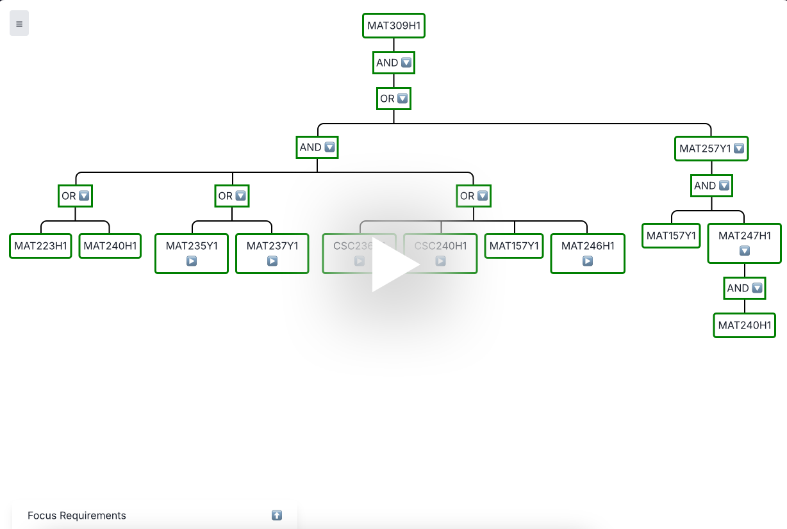

# Prerequisite Tree Visualizer (UofT) - Frontend Visualizer

### A web application that visualizes prerequisite trees for courses at the University of Toronto, with a focus on the Computer Science department. 

---

### Backend Parts

- [Backend Server and Algorithms processing for the application](https://github.com/jerryq0101/uoft_proj_api)
- [Scripts to scrape UofT Course Pages](https://github.com/jerryq0101/uoft_proj_data_collect)

### Features

- Visualizer Direct and full Prerequisites
- Add completed and desired courses to show progression in prerequisites
- Display common prerequisite courses between different prerequisite trees
- View Focus requirements for Computer Science majors

### DEMO BELOW 👇👇👇
<a href="https://www.loom.com/share/eb36ca35833e4d8d8d2c9bfcde9f4ceb" target="_blank">
  
</a>

### Get Started

1. Clone the Repository:
    ```
    git clone https://github.com/jerryq0101/uoft_proj_frontend.git
    ```

2. Navigate to the project directory

3. Install Dependencies:
    ```
    npm i
    ```

4. Create a `.env` file in the root directory
    ```
    API_KEY=your_api_key
    ```
    (This is the Flask API key from [here](https://github.com/jerryq0101/uoft_proj_api))

5. Run the development server
    ```
    npm run dev
    ```

6. Open [http://localhost:3000](http://localhost:3000) in your browser to see the application.


### Project Structure

```
└── uoft_proj_frontend/
    └── src/
        └── app/
            ├── server-actions/
            │   └── actions.tsx
            ├── BottomBar.tsx
            ├── MainLeftBar.tsx
            ├── MainPage.tsx
            └── ...
    └── files/
        └── focus_reqs.ts
```

- `MainPage.tsx`: renders the tree and is the main component responding to the left bar's inputs

- `MainLeftBar.tsx`: handles inputs, directs data fetching, and changes data states in `MainPage.tsx`
- `BottomBar.tsx`: formats the focus information from `focus_reqs.ts`
- `actions.tsx`: is a Next.js server actions file  with functions that fetches prereq tree data from the live Flask API
- `focus_reqs.ts`: is a storage of CS Focus requirements in variables
